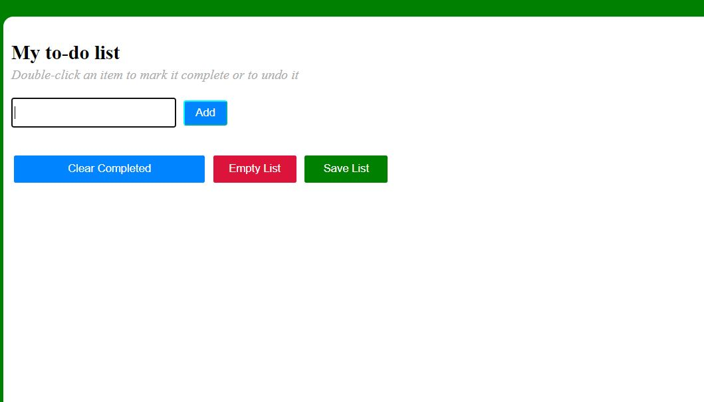
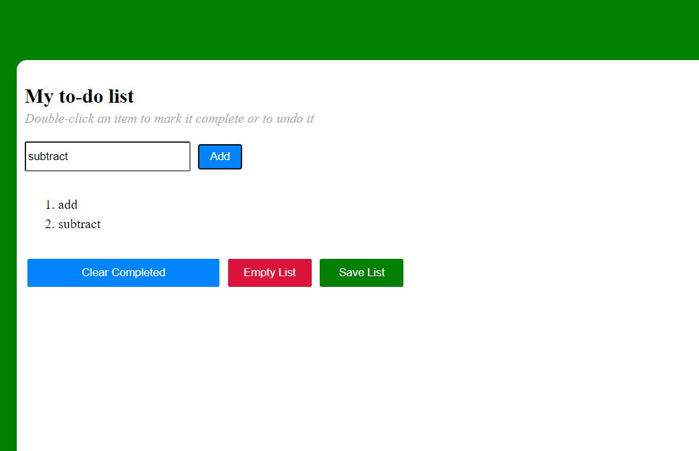
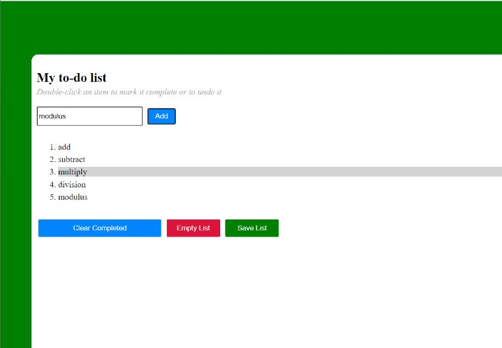
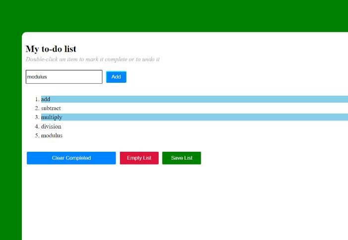
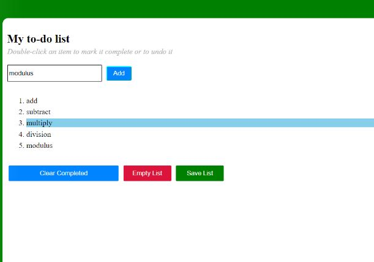
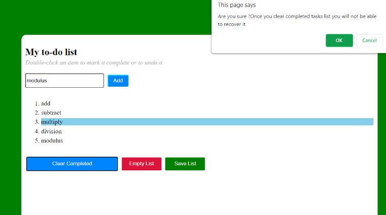
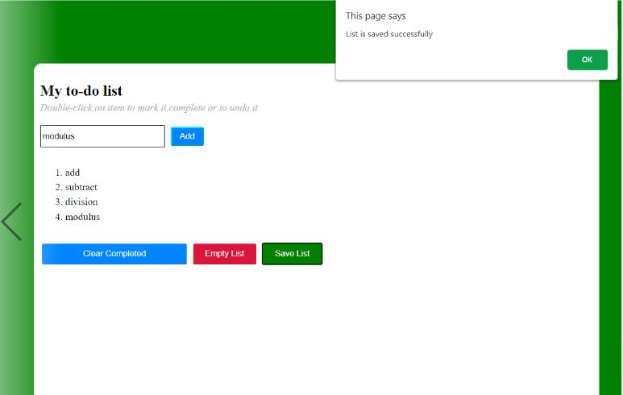
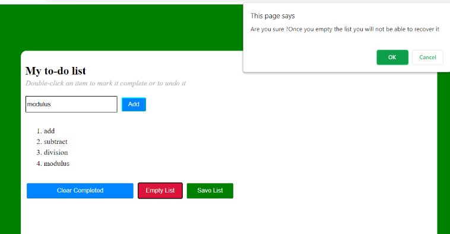
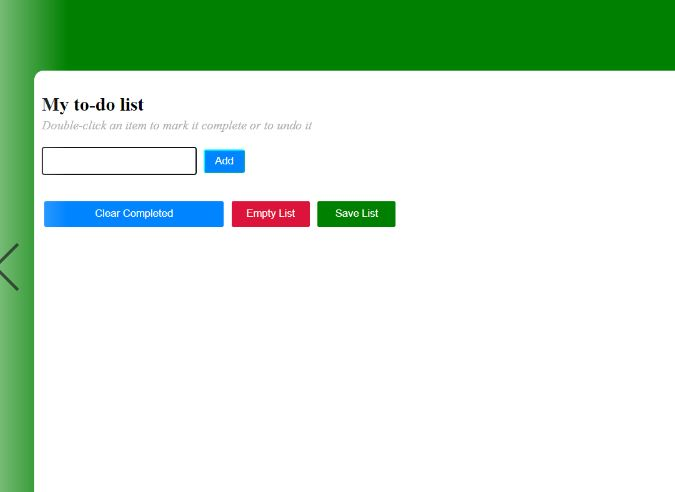

# Todo-app
Manage your Todo  list on  your device
 
* Add tasks to list
* Mark tasks as completed
* Remove completed tasks
* Empty tasks list

## Demo
https://sanchi-lg.github.io/Todo-app/

  
   
    
   
    
   
    
   
    
   
    
   
    
   
    
   
    
   

